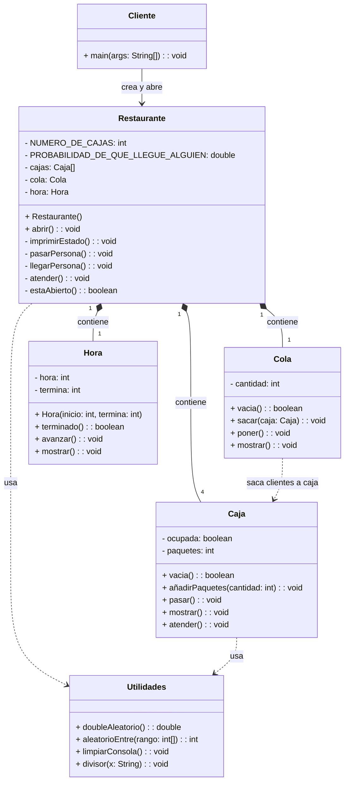
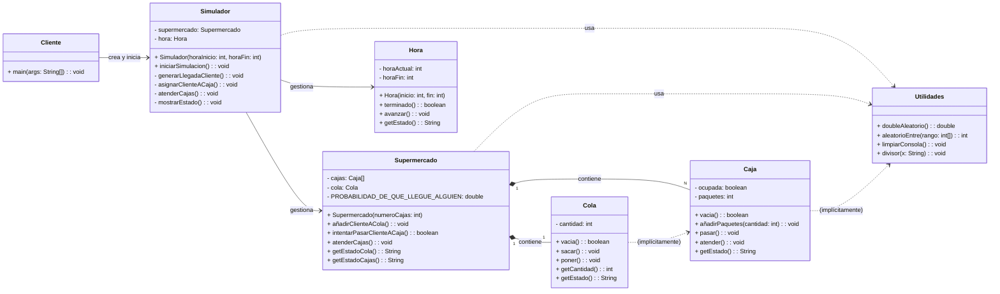

# 🛒 Simulación de Supermercado: Reto CCCF 🚀

¡Bienvenido al proyecto de simulación de supermercado! Este repositorio modela y simula el funcionamiento de un centro comercial, desde la llegada de clientes hasta la gestión de colas y la atención en cajas.

---

## 📝 El Desafío Original: [`enunciado.md`](doc/enunciado.md)

Sumérgete en el corazón del problema. El archivo [`enunciado.md`](doc/enunciado.md) detalla el reto original del Centro Comercial CF de El Alisal. Aquí encontrarás:

*   **Requisitos Base**: Cómo se simula la llegada de clientes, el estado de la cola y la atención en cajas.
*   **Reto Extendido**: Métricas clave al finalizar la jornada, como el número de minutos sin cola, personas atendidas y artículos vendidos.
*   **Reto Ampliado**: Supuestos avanzados como la gestión de cajas adicionales en momentos de alta demanda y un rol de superadministrador para el control de cajas.

---

## 📊 Arquitectura Actual

Aquí puedes ver un diagrama de clases UML que resume la estructura actual del código Java:

El archivo [`resumen.puml`](doc/resumen.puml) contiene el código fuente PlantUML de este diagrama, y [`resumen.mmd`](doc/resumen.mmd) contiene el código fuente Mermaid.

*   `Caja`: La lógica de atención al cliente.
*   `Cliente`: El punto de entrada de la simulación.
*   `Cola`: La gestión de la fila de espera.
*   `Hora`: El control del tiempo de la simulación.
*   `Restaurante`: El orquestador principal de la simulación.
*   `Utilidades`: Funciones auxiliares.

Este diagrama es tu guía visual para entender la estructura del código existente.

---

## ✨ Ideas para el Futuro

Siempre hay espacio para mejorar. Aquí te presentamos una **propuesta de reorganización** del programa:

El archivo [`ideas.puml`](doc/ideas.puml) contiene el código fuente PlantUML de este diagrama, y [`ideas.mmd`](doc/ideas.mmd) contiene el código fuente Mermaid.

*   **Paquetes Lógicos**: Agrupación de clases en "Simulación", "Entidades Base" y "Utilidades" para una mejor separación de responsabilidades.
*   **Clase `Simulador`**: Un nuevo orquestador central para gestionar el flujo de la simulación de manera más limpia y extensible.

Explora estas ideas para visualizar cómo el proyecto podría evolucionar hacia una solución más mantenible y escalable.

---

¡Esperamos que esta documentación te sea de gran utilidad para comprender y contribuir a este emocionante proyecto de simulación!